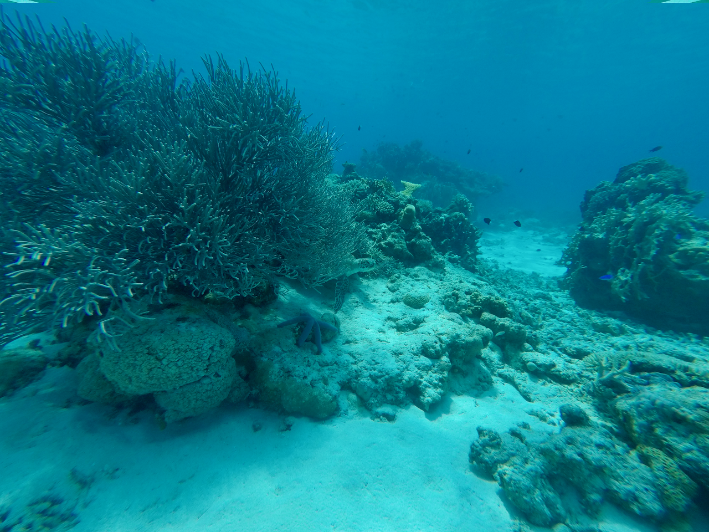

# Role of Transposable elements in transcriptomic response to Ocean Acidification in coral reef fish
Part of the thesis is on TE transcriptomics for ocean acidification.

Overview
Climate change is an unavoidable threat to the global environment.
 Many studies have confirmed that climate change causes ocean warming and, inevitably, a rise in acidity, events like coral bleaching, and loss of biodiversity1. The rapidly changing environment will likely continue to affect the oceans, thus pushing marine organisms to adapt to new harsh conditions. In particular, coral reef fish crucial for the ocean ecosystem may need to develop adaptation mechanisms to rising ocean acidity or go extinct.
 
Authors:
Kaisar Dauyey 

Photo taken at Aka island, Keramashoto National Park
April 17, 2024

Thank you for visiting this project!

# Contents

1. Raw data preparation from HTseq output
2. R scripts
3. Supplemetary data
4. Original figures

## License
All files are licensed under the [MIT license](http://opensource.org/licenses/MIT). This project may not be copied, modified, or distributed except according to those terms.

